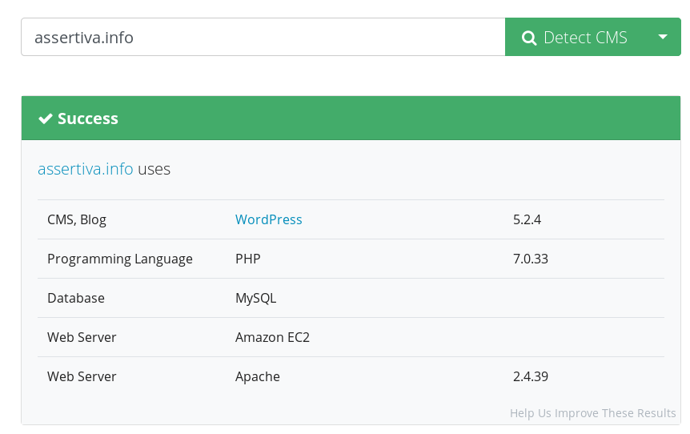

# WhatCMS
## Antes de começar
O que é um CMS ? CMS é um sistema gerenciador de conteúdo(Content Management System) e basicamente ele é responsável por gerenciar o conteúdo do nosso site ou sistema.

Temos alguns CMS como:
- Wordpress
- Joomla
- Moodle
- Drupal
- Presta shop
- PhpBB

## Conhecendo o WhatCMS
Podemos verificar o CMS usado usando o WhatCMS , com ele podemos verificar usando uma fonte publica para verificar se é um Wordpress e sem nós interagir diretamente com o site que está sendo verificado. O WhatCMS é um exemplo de ferramenta que pode nos auxiliar , ele foi lançado em Dezembro de 2011 , inicialmente só conseguia reconhecer os principais CMS e hoje ele consegue reconhecer mas de 422 CMS's.

Atualmente esse é como o site é , não precisamos realizar cadastrado para realizar testes e verificar sites.


Vou realizar um teste em um forum , veja o resultado **IPS community suite**.


Agora vou realizar outro teste em um blog , podemos ver que o resultado é o Wordpress e a sua versão.


Já podemos ver outro exemplo que ele retorna qual CMS está usando , só que não é retornado a sua versão e quanto mais informações nós sabermos do alvo melhor.


## Os sistemas mais populares
Podemos ver quais são os sistemas mais usados , veja um gráfico listando os top 10:


Além de poder ver todos os 422 sistemas no seguinte link:
```sh
https://whatcms.org/CMS-Statistics
```

## Podemos ver quais os métodos usado no WhatCMS
É possível nós vermos os métodos usados para descobrir os CMS , podemos usar:

- Meta
- Headers
- Markup
- Javascript
- Dominio
- Versões

```sh
https://whatcms.org/Content-Management-Systems
```

## Conhecendo a API do WhatCMS
Podemos ir até a pagina da API:
```sh
https://whatcms.org/API
```

Inicialmente é a pagina principal onde temos informações sobre a API , por exemplo:

Onde podemos criar uma conta:
```sh
https://whatcms.org/API?cmd=RegisterForm
```

Podemos ver os planos disponíveis , nesses testes estamos usando uma conta free e nele podemos:
- Realizar 1000 (mil) requisições por mês
- 1 requisição a cada 10 segundos

```sh
https://whatcms.org/Subscriptions?cmd=PlanOptions
```

Infelizmente opções como a **Batch Detections** , nela temos informações detalhadas , além de poder testar diversos de sites ao mesmo teste e trazer gráficos dos resultados
```sh
https://whatcms.org/Batch?cmd=NewBatch
```

## Usando a API do WhatCMS
Depois de criar uma conta podemos ver a documentação , aqui podemos ver como:
- Exemplo de requisição
- Parâmetros da requisição
- Resultado em JSON
- whatcms-php (Integrar em aplicativos PHP)
- Podemos usar endpoints para verificar informações da conta
- Informações sobre resultados (200 OK, 111 Invalid Url)

Veja a documentação em
```sh
https://whatcms.org/Documentation
```

### Realizando uma consulta via linha de comando
Podemos realizar uma simples consultado usando a nossa linha de comando , só precisamos passar algumas informações como:
- API
- Key
- Url

Veja um exemplo:
```sh
curl -G https://whatcms.org/APIEndpoint/Detect --data-urlencode key="3847384738478347q4939432098837483473434" --data-urlencode url="en.wikipedia.org"
```

```sh
#pip install pywhatcms
from pywhatcms import whatcms

whatcms('SUA-KEY', 'fatecourinhos.edu.br')

print(whatcms.name)
print(whatcms.code)


print(whatcms.confidence)
print(whatcms.cms_url)
print(whatcms.version)
print(whatcms.msg)
print(whatcms.id)
print(whatcms.request)
print(whatcms.request_web)
```

> Codigo em **Python**

## Mão na massa
Vamos usar para a busca o site abaixo.
```sh
https://assertiva.info
```

Já sabemos que ele pode ser um provavel wordpress devido ao subdiretorio chamado **https://assertiva.info/wp-admin**.

Ao usar o **whatcms** podemos ver informaçoes interessantes, como por exemplo.

